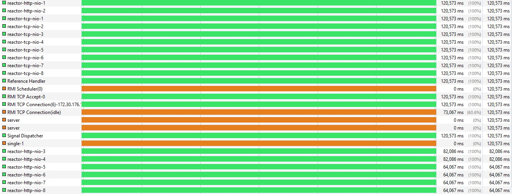
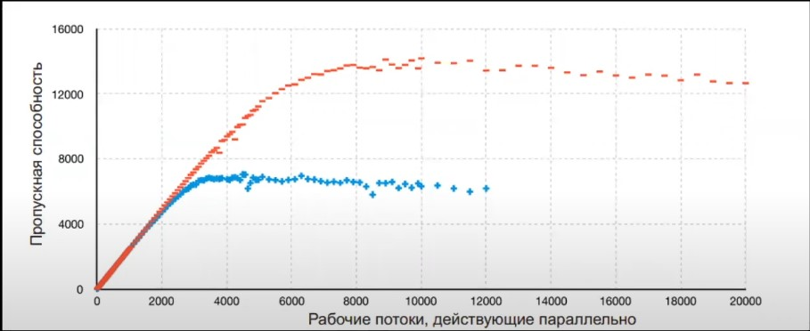
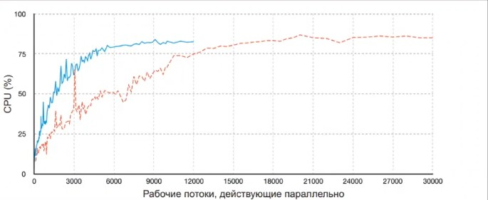
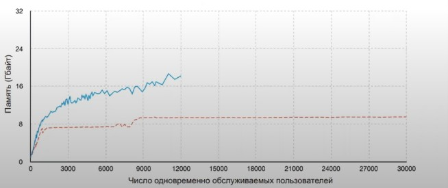

# Reactive WebFlux Project

Демонстрационный проект, показывающий работу **Spring WebFlux** с двумя реактивными базами данных:

- **PostgreSQL** через **R2DBC (Reactive Relational Database Connectivity)**
- **Cassandra** через **реактивный драйвер**

---

## Архитектура проекта

Проект состоит из двух независимых сервисов:

### **1. Reactive Postgres Service**
Работает с PostgreSQL через R2DBC.

### **2. Reactive Cassandra Service**
Использует реактивный драйвер Cassandra.

Каждый сервис запускается и масштабируется отдельно.

---

## Преимущества Spring WebFlux

WebFlux обеспечивает:

- **Снижение простоя потоков на 95–97%**
- **Эффективную работу с небольшим числом потоков**
- **Неблокирующую обработку запросов**
- **Лучшее использование ресурсов под высокой нагрузкой**

---

## Почему Cassandra

Cassandra выбрана как высокопроизводительная распределённая NoSQL СУБД:

- **Высокая доступность и отказоустойчивость**
- **Горизонтальная масштабируемость**
- **Поддержка реактивных драйверов**

---

## Мониторинг и метрики

Проект включает систему мониторинга:

- **Prometheus** — сбор метрик  
- **Grafana** — визуализация  

---

## Нагрузочное тестирование

Используется **Gatling**.

В проекте есть:

- готовый тест для PostgreSQL сервиса;
- возможность адаптировать конфигурацию под Cassandra.

---

## Анализ производительности

Используемые инструменты:

- **VisualVM** — анализ потоков и idle-time  
- **Grafana** — дашборды метрик  
- **Gatling Reports** — отчёты нагрузочного тестирования  

### **Результаты**

- Синяя линия — классическое блокирующее приложение  
- Красная линия — реактивное приложение на WebFlux  

   (docs/Работа_потоков_БезWebFlux.jpg)

  

  

  

### **Выводы**

- Снижение нагрузки на потоки  
- Улучшенная масштабируемость  
- Снижение потребления ресурсов  
- Увеличение отзывчивости системы  

---

## Заключение

Проект демонстрирует преимущества реактивного подхода в Spring WebFlux и работу с реактивными СУБД, показывая значительный выигрыш в производительности и масштабируемости по сравнению с блокирующей архитектурой.
